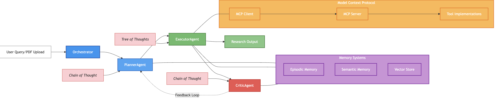

# Agent Research Assistant

A self-improving, multi-agent LLM system designed to assist with research paper analysis and complex problem-solving.

This project implements an advanced AI agent system based on the principles outlined in "Architecting Self-Improving LLM Agent Systems for Complex Task Execution". The system uses a multi-agent architecture with specialized roles (Planner, Executor, Critic), sophisticated reasoning mechanisms (Chain of Thought, Tree of Thoughts), structured memory systems, and the Model Context Protocol (MCP) for tool integration.

## Key features include:

- **Multi-Agent Architecture**: Specialized agents work together to tackle complex tasks
- **Advanced Reasoning**: Chain-of-Thought and Tree-of-Thoughts reasoning for complex problem-solving
- **Hybrid Memory System**: Episodic, semantic, and procedural memory for context retention
- **Standardized Tool Integration**: MCP protocol for seamless integration with external tools
- **Self-Improvement**: Autonomous improvement through feedback and critic evaluation
- **PDF Analysis**: Built-in tools for analyzing academic papers and research documents

## System Architecture

The system consists of the following main components:

- **Agents**:
  - Planner Agent: Creates structured plans for complex tasks using Chain of Thought reasoning
  - Executor Agent: Carries out specific tasks using Tree of Thoughts reasoning and tool access
  - Critic Agent: Evaluates outputs and provides feedback using Chain of Thought reasoning

- **Reasoning**:
  - Chain of Thought: Linear, step-by-step reasoning used by Planner and Critic agents
  - Tree of Thoughts: Exploring multiple reasoning paths simultaneously, used by Executor agent

- **Memory**:
  - Episodic Memory: Stores specific events and experiences from research tasks
  - Semantic Memory: Stores facts and concepts for domain understanding
  - Vector Store: Enables similarity-based memory retrieval for relevant context

- **MCP (Model Context Protocol)**:
  - Client: Connects to tool servers for standardized communication
  - Server: Exposes tools via standardized interfaces
  - Tool Implementations: Including PDF Reader, Vector Database, and other extensible tools

- **Orchestration**:
  - Orchestrator: Coordinates agent interactions and workflow from input to output
  - Feedback Loop: Enables self-improvement through critic evaluation



The architecture diagram shows the complete workflow: user queries or PDF uploads are processed by the Orchestrator, which coordinates the multi-agent system. The Planner Agent uses Chain of Thought reasoning to create research plans, which the Executor Agent implements using Tree of Thoughts reasoning. The Executor interacts with tools via the Model Context Protocol and accesses the Memory Systems. The Critic Agent evaluates the research output and provides feedback to the Planner, creating a self-improvement loop. All three agents contribute to generating the final Research Output with findings, identified gaps, and novel approaches.

## Getting Started

- Clone the repository:
```bash
git clone https://github.com/bharadwajvyadavalli/agent_research_assistant.git
cd agent_research_assistant
```

- Install dependencies:
```bash
pip install -r requirements.txt
```

- Create a `.env` file with your API key:
```bash
OPENAI_API_KEY=your_api_key_here
```

## Usage

Run the assistant in interactive mode:
```bash
python main.py
```

In interactive mode, you can enter queries directly or use the following commands:
- `!pdf <path>`: Process a PDF document
- `!exit`: Exit the application

Process a single query and exit:
```bash
python main.py --query "Explain the benefits of multi-agent LLM systems"
```

Process a PDF file with an optional query:
```bash
python main.py --pdf "path/to/document.pdf" --query "Summarize the key findings"
```

Run the assistant as an API server:
```bash
python main.py --api --host localhost --port 8000
```

## API Endpoints

The API exposes the following endpoints:
- `POST /query`: Process a query (JSON body: `{"query": "your query", "context": {}}`)
- `POST /pdf`: Process a PDF file (JSON body: `{"pdf_path": "path/to/file.pdf", "query": "optional query"}`)

## Practical Examples

For a detailed end-to-end example of how this system works in practice, including a comprehensive workflow for time series forecasting research analysis, see [usage_examples.md](./docs/usage_examples.md).

## Custom Tools

You can create custom tools by implementing new MCP tool servers. For example:

```python
from mcp.protocol import MCPTool
from mcp.server import StandaloneToolServer

class MyCustomTool:
    @staticmethod
    async def execute_tool(param1, param2):
        # Tool implementation
        return {"result": "output"}

# Register and start the tool server
server = StandaloneToolServer()
server.register_tool("my_custom_tool", MyCustomTool.execute_tool)
await server.start()
```

## Project Structure

```
agent_research_assistant/
├── assets/
│   └── images/
│       └── architecture_diagram.png  # System architecture diagram
├── docs/
│   └── USAGE_EXAMPLES.md             # Detailed usage examples
├── mcp/
│   ├── protocol.py                   # MCP protocol definitions
│   ├── client.py                     # MCP client implementation
│   ├── server.py                     # MCP server implementation
│   └── tools/                        # Tool implementations
│       ├── pdf_reader.py             # PDF analysis tool
│       └── vector_store.py           # Vector storage tool
├── agents/
│   ├── planner.py                    # Planner agent implementation
│   ├── executor.py                   # Executor agent implementation
│   └── critic.py                     # Critic agent implementation
├── memory/
│   ├── episodic.py                   # Episodic memory implementation
│   ├── semantic.py                   # Semantic memory implementation
│   └── vector_store.py               # Vector store implementation
├── main.py                           # Main application entry point
├── requirements.txt                  # Project dependencies
├── .env                              # Environment variables (not in repo)
└── README.md                         # This file
```

## License

This project is licensed under the MIT License.

## Acknowledgements

This project draws inspiration from recent advances in LLM agent architectures, particularly the work on Chain-of-Thought and Tree-of-Thoughts reasoning, as well as the developing field of self-improving AI systems.
