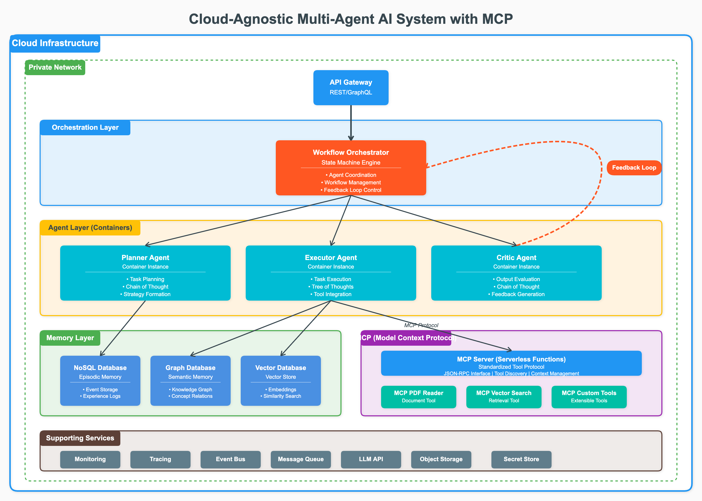

# Agent Research Assistant

A self-improving, multi-agent LLM system designed to assist with research paper analysis and complex problem-solving.

This project implements an advanced AI agent system based on the principles outlined in "Architecting Self-Improving LLM Agent Systems for Complex Task Execution". The system uses a multi-agent architecture with specialized roles (Planner, Executor, Critic), sophisticated reasoning mechanisms (Chain of Thought, Tree of Thoughts), structured memory systems, and the Model Context Protocol (MCP) for tool integration.

## Key features include:

- **Multi-Agent Architecture**: Specialized agents work together to tackle complex tasks
- **Advanced Reasoning**: Chain-of-Thought and Tree-of-Thoughts reasoning for complex problem-solving
- **Hybrid Memory System**: Episodic, semantic, and procedural memory for context retention
- **Standardized Tool Integration**: MCP protocol for seamless integration with external tools
- **Self-Improvement**: Autonomous improvement through feedback and critic evaluation
- **PDF Analysis**: Built-in tools for analyzing academic papers and research documents

## System Architecture

The system consists of the following main components:

- **Agents**:
  - Planner Agent: Creates structured plans for complex tasks
  - Executor Agent: Carries out specific tasks using available tools
  - Critic Agent: Evaluates outputs and provides feedback

- **Reasoning**:
  - Chain of Thought: Linear, step-by-step reasoning
  - Tree of Thoughts: Exploring multiple reasoning paths simultaneously

- **Memory**:
  - Episodic Memory: Stores specific events and experiences
  - Semantic Memory: Stores facts and concepts
  - Vector Store: Enables similarity-based memory retrieval

- **MCP (Model Context Protocol)**:
  - Client: Connects to tool servers
  - Server: Exposes tools via standardized interfaces
  - Tool Implementations: E.g., PDF Reader

- **Orchestration**:
  - Orchestrator: Coordinates agent interactions and workflow
  - Feedback Loop: Enables self-improvement



The diagram illustrates how these components interact: the Orchestrator coordinates the workflow, the Planner uses Chain of Thought reasoning to create plans, the Executor implements these plans using Tree of Thoughts reasoning and accesses tools via MCP, and the Critic evaluates outputs to provide feedback for continuous improvement.

## Getting Started

- Clone the repository:
```bash
git clone https://github.com/yourusername/agent-research-assistant.git
cd agent-research-assistant